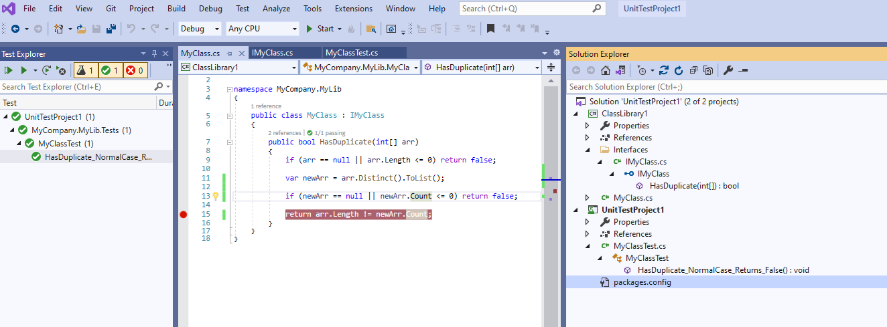
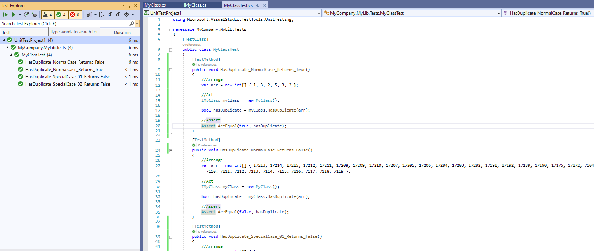

# Unit Testing with MSTest






```
Install-Package log4net
Install-Package Newtonsoft.Json
Install-Package Dapper
Install-Package Dapper.Contrib
Install-Package Dapper.SqlBuilder
Install-Package Humanier
Install-Package NodaTime
Install-Package CsvHelper
Install-Package Refit
```

# References
+ https://github.com/gtechsltn/DapperSelect